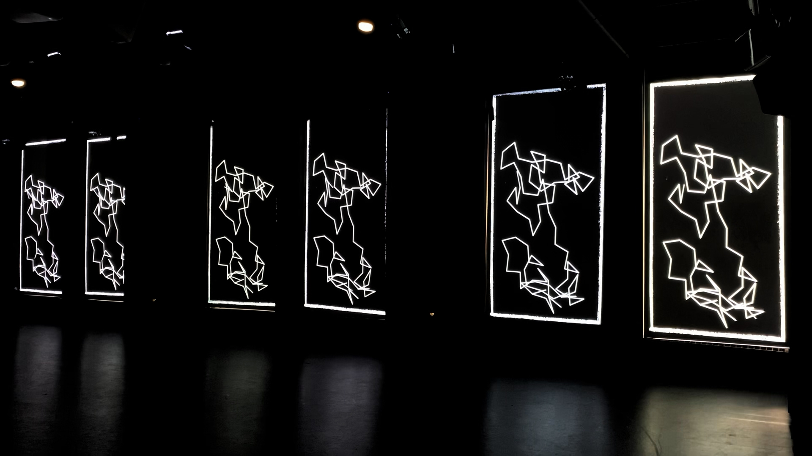

# [Animated Line Art](https://anselbobrow.com/line-art/)

## Demonstration
A video demonstration of the installation at Yale's CCAM.

## About
The inspiration and implementation details are written up in the [blog post](./blog_post.md).

## Installation
clone, cd into directory, make sure node is installed and run

`npm install && npm run dev`

once app starts, connect in your web browser at [localhost:8080](http://localhost:8080/)

## Usage
press `space` to pause and resume animation

click or refresh page to restart

adjust the parameters such as `SPEED`, `MAX_DELAY_DEPTH`, `LINE_LENGTH`, or `DELAY_PERIOD` in `src/sketch.ts` and save file to reload server
